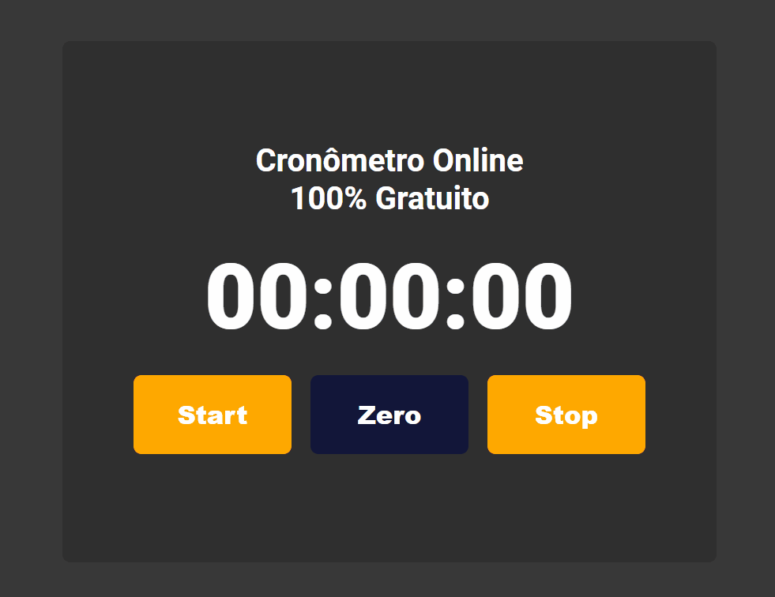
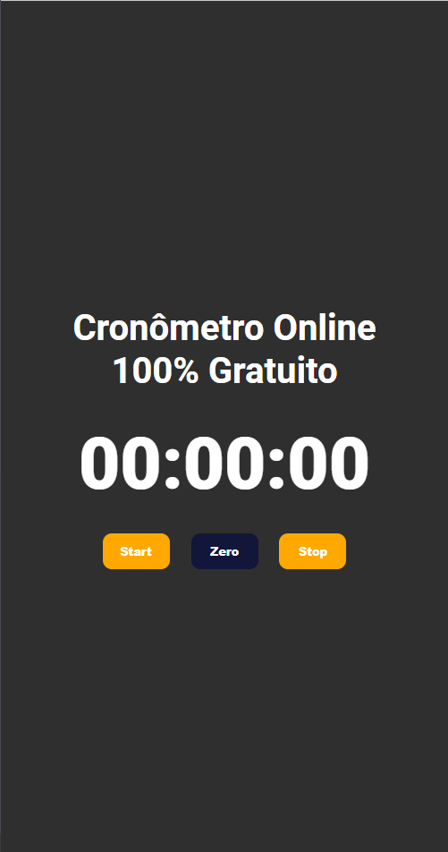
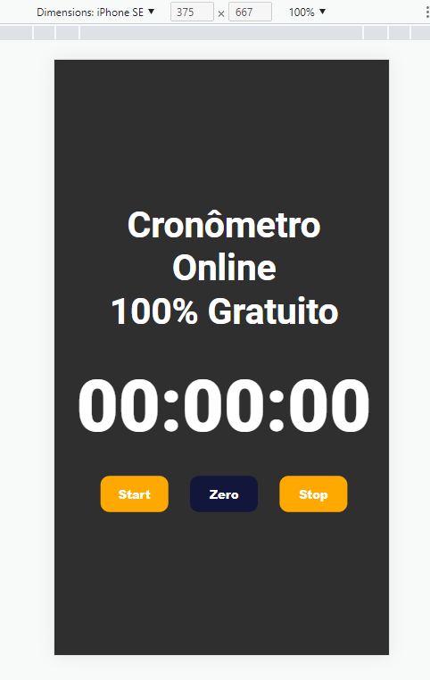

<h1 align="center">Cronômetro</h1>

<h1  align="center">

</h1>

<br>

[](https://github.com/Devrieff/Pokedex/blob/main/LICENSE)

<br>

## 📖 **Abount**

An objective timer but with a very cool designer, fully responsive and easy to use

<br>

## 🔨 **Tool**
- [JavaScript](https://developer.mozilla.org/pt-BR/docs/Web/JavaScript)
- [HTML5](https://developer.mozilla.org/en-US/docs/Glossary/HTML5)
- [Css3](https://developer.mozilla.org/pt-BR/docs/Web/CSS)


<h1 align="center">



</h1>


<br>

## ♻️ **How contribute**

```bash
#Clone the project
$ git clone https://github.com/gabriel-rieff/Stopwatch.git
```
